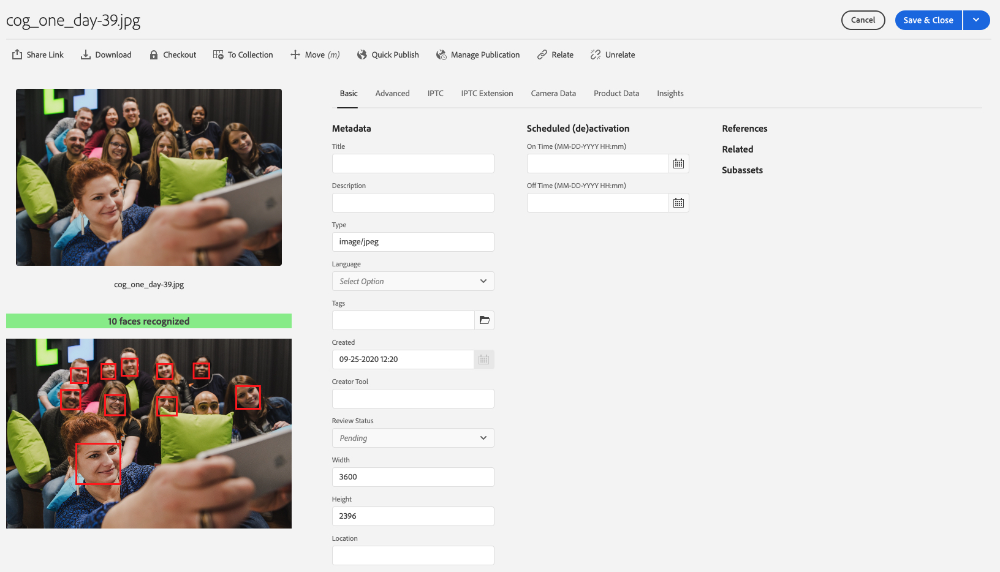

# AEM as a Cloud Service - Show faces in Assets Metadata editor

This project is adds simple extension to the Assets metadata editor
- Added new component below asset preview
- Component presents:
    - Amount of faces recognized (in general face suppose to have both eyes and mouth) by the custom metadata worker
    - Preview of the asset with annotated face regions
    


## Modules

This project consists only modules that are required
* ui.apps: contains the /apps parts of the project, with metadata editor overlay + clientlib to show annotated faces
* all + ui.apps.structure: standard modules to bundle the code

## How to build

To build all the modules run in the project root directory the following command with Maven 3:

    mvn clean install

To build all the modules and deploy the `all` package to a local instance of AEM, run in the project root directory the following command:

    mvn clean install -PautoInstallSinglePackage

Or to deploy it to a publish instance, run

    mvn clean install -PautoInstallSinglePackagePublish

Or alternatively

    mvn clean install -PautoInstallSinglePackage -Daem.port=4503

Or to deploy only the bundle to the author, run

    mvn clean install -PautoInstallBundle

Or to deploy only a single content package, run in the sub-module directory (i.e `ui.apps`)

    mvn clean install -PautoInstallPackage
    
## Deploy to AEM as Cloud service

To build & deploy on the AEMasaCloud you need to push the code to he Cloud Manager git repository.
Just add the new `remote` to this repo, e.g. as `cloudmaanger` and push it to that remote
```
git remote add cloudmanager https://git.cloudmanager.adobe.com/<orgName>/<repoName>/
git push cloudmanager
```
Once it's pushed, you can go to Cloud Manager (assuming you have configured Dev pipeline), edit your pipeline and pick
the branch `firefly-asset-faces` and then **start pipeline build**. After couple of minutes the changes are available 
on your instance.
In order to verify it, just open the Asset metadata editor. Below the asset preview you should see a grey banner saying
**0 faces recognized**.

## Configure Processing profiles and detect faces

Follow the blog post [XYZ]() about how to create & deploy custom metadata worker as well as how to configure AEM and how to use it.

## Maven settings

The project comes with the auto-public repository configured. To setup the repository in your Maven settings, refer to:

    http://helpx.adobe.com/experience-manager/kb/SetUpTheAdobeMavenRepository.html
